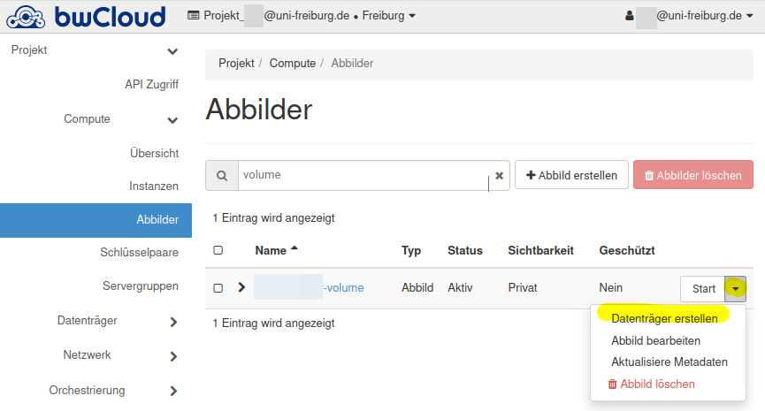

# How to migrate your old bwCloud Freiburg images to the new bwCloud

A service of the bwForCluster NEMO.

!!! attention "DISCLAIMER"
    This in an unofficial migration guide.
    We do not guarantee for broken images or if the guide does not work as described.

## Community Migration Guide

This guide is only for users of the University of Freiburg who have bwCloud images in the Freiburg region and want to migrate them to the new bwCloud.

Follow these steps:

1. First install [`python-openstackclient`](https://pypi.org/project/python-openstackclient/) CLI, e.g:
```bash
pip install python-openstackclient --user
```
Some distributions provide packages that you can check first.
Windows users might try to use [Windows Subsystem for Linux](https://docs.microsoft.com/en-us/windows/wsl/install) or install Linux in VirtualBox, etc.
2. Create a credentials file for the old bwCloud instance, e.g.: `bwcloud-old-creds.sh`
Copy the contents of the following code window and replace `<RZ_ID>` with your university ID, e.g. the one you use for myLogin or [myAccount](https://myaccount.uni-freiburg.de).
Change your project name if necessary.
```bash
#!/usr/bin/env bash
export OS_AUTH_URL=https://idm01.bw-cloud.org:5000/v3
export OS_USERNAME="<RZ_ID>@uni-freiburg.de"
# change to old group project if necessary, e.g. freiburg_mygroup
export OS_PROJECT_NAME="Projekt_$OS_USERNAME"
unset OS_PROJECT_ID
export OS_USER_DOMAIN_NAME="Default"
if [ -z "$OS_USER_DOMAIN_NAME" ]; then unset OS_USER_DOMAIN_NAME; fi
export OS_PROJECT_DOMAIN_ID="default"
if [ -z "$OS_PROJECT_DOMAIN_ID" ]; then unset OS_PROJECT_DOMAIN_ID; fi
unset OS_TENANT_ID
unset OS_TENANT_NAME
echo "Please enter your OpenStack Password for project $OS_PROJECT_NAME as user $OS_USERNAME: "
read -sr OS_PASSWORD_INPUT
export OS_PASSWORD=$OS_PASSWORD_INPUT
export OS_REGION_NAME="Freiburg"
if [ -z "$OS_REGION_NAME" ]; then unset OS_REGION_NAME; fi
export OS_INTERFACE=public
export OS_IDENTITY_API_VERSION=3
```
3. Open a shell like `bash` or if you use another shell, start `bash`.
4. Source your old bwCloud credentials.
You will be prompted to enter your old bwCloud password.
If you do not remember it, bwCloud support will have to generate a new one for you.
```bash
$ source bwcloud-old-creds.sh
Please enter your OpenStack Password for project Projekt_<RZ_ID>@uni-freiburg.de as user <RZ_ID>@uni-freiburg.de: 
```
5. Run `openstack server list`.
You should see your images or the images from your group project.
Copy the ID of the image you want to download, e.g. `7fd1037e-b9fa-464b-9704-0dd60461d83a`.
6. Check if there is a snapshot for this image that you can download.
To check this, use this ID to get the ID of the snapshot:
```bash
$ openstack image list --shared | grep 7fd1037e-b9fa-464b-9704-0dd60461d83a
| 3e51e17a-c04d-345a-8712-a13f3b8fb99b | 7fd1037e-b9fa-464b-9704-0dd60461d83a-snapshot-2022-03-11-19-40-06 | active |
```
If there is no snapshot you can generate one yourself:
```bash
$ openstack server image create --name 7fd1037e-b9fa-464b-9704-0dd60461d83a-snapshot-$(date -I) 7fd1037e-b9fa-464b-9704-0dd60461d83a
```
7. Use the snapshot ID for your download:
```bash
$ glance image-download 3e51e17a-c04d-345a-8712-a13f3b8fb99b --file myimage.img --progress
```
8. Once your image is downloaded, visit [https://portal.bw-cloud.org/project/images](https://portal.bw-cloud.org/project/images) and select "Compute -> Images":

9. Configure your image and upload it.
The minimum settings for hard disk and RAM are optional.
Select the visibility **Private**!
!!! attention
    If you don't choose the visibility "Private", others can use your image as base image for their services.

10. You can start a new instance with this image.
Many other OpenStack settings need to be reconfigured, e.g. "Security Groups".
This is not covered in this guide.

### Migrate Volumes

This is highly experimental and untested yet.
First, perform steps 1-4 from the top instructions.

Then, follow these steps:

1. Run `openstack volume list`.
You should see your volumes or the volumes from your group project.
Copy the ID of the volume you want to download, e.g. `da832458-2b9a-144b-2904-0dd604d261da`.
2. Create a new image from this volume:
```bash
$ openstack image create --volume da832458-2b9a-144b-2904-0dd604d261da --force newimagename
```
If you have errors running this command, see Troubleshooting for a solution.
3. Check if the volume image is already created.
```bash
$ openstack image list | grep newimagename
| 93da1233-bfee-453b-9c1d-59aa45da20c7 | newimagename                                                      | active |
```
4. Use the new image ID for your download:
```bash
$ glance image-download 93da1233-bfee-453b-9c1d-59aa45da20c7 --file myvolume.img --progress
```
5. Upload your image to OpenStack (see instructions above or "Upload image via CLI").
6. Once your image is uploaded, you can create a volume from it.
Do this either in the GUI or use the CLI.
For the GUI, visit [https://portal.bw-cloud.org/project/images](https://portal.bw-cloud.org/project/images) and select "Compute -> Images".
Select "Create Volume" from the menu.

For the CLI, you must first set up your credentials.
To do this, follow steps 1-4 from the "Uploading an image via CLI" guide.
Then check the ID of your image with `openstack image list`.
Check the size of the image with this ID:
```bash
openstack image show --human-readable 991346f0-7780-19f3-34b1-c854c45105da
```
Unfortunately, the sizes are displayed in different units, so `openstack image show` shows the size in GB, but GiB is used when creating (e.g. 12.9GB ~ 12GiB).
Now use the image ID to create a volume:
```bash
openstack volume create --image 991346f0-7780-19f3-34b1-c854c45105da --size 12 myvolume # change size
```

### Upload Image through CLI

If uploading via the graphical user interface does not work for some reason, you can try it via the command line interface.
First, perform steps 1-6 from the top instructions.

Then, follow these steps:

1. Login to bwCloud: [https://portal.bw-cloud.org/identity/application_credentials/](https://portal.bw-cloud.org/identity/application_credentials/).
Select "Identity -> Application Secrets".

2. Select a name and set a strong secret.

3. Download `openrc` file.
4. Open a new bash window and source the credentials:
```bash
source app-cred-CLI-openrc.sh
```
5. Create/Upload image to new bwCloud:
```bash
openstack image create --file myimage.img --private myimage
```
Check status with `openstack image list`.

### Troubleshooting

If you get an error while running step 2 in the guide "Migrate Volumes", you can try to downgrade your tools.
This version numbers worked after some trial and error:

```bash
$ pip install python-openstackclient==3.18 --user
$ pip install python-cinderclient==5 --user
```
