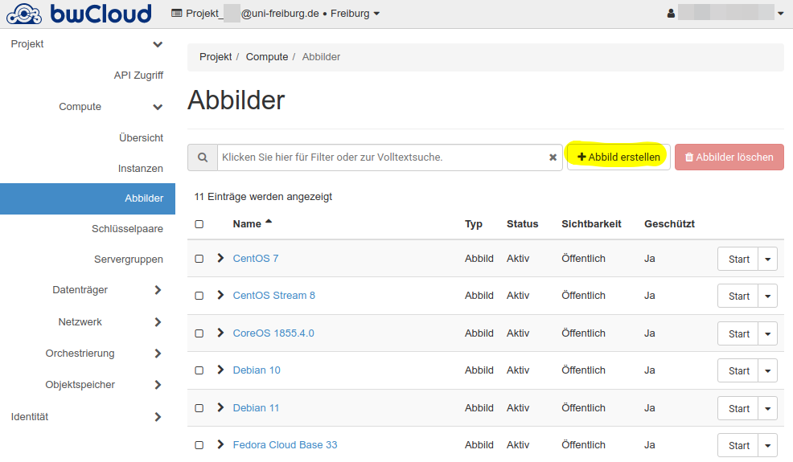
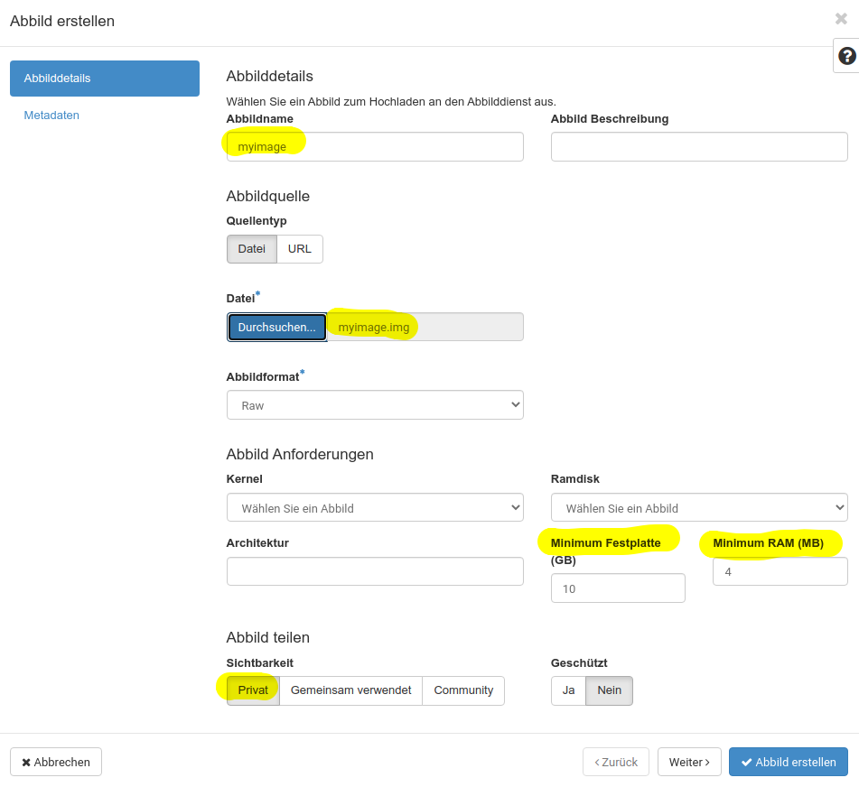
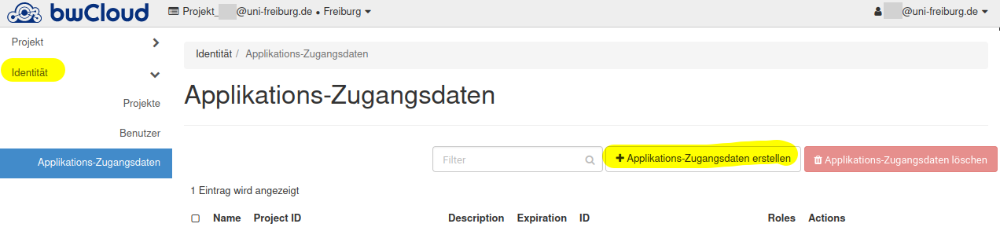
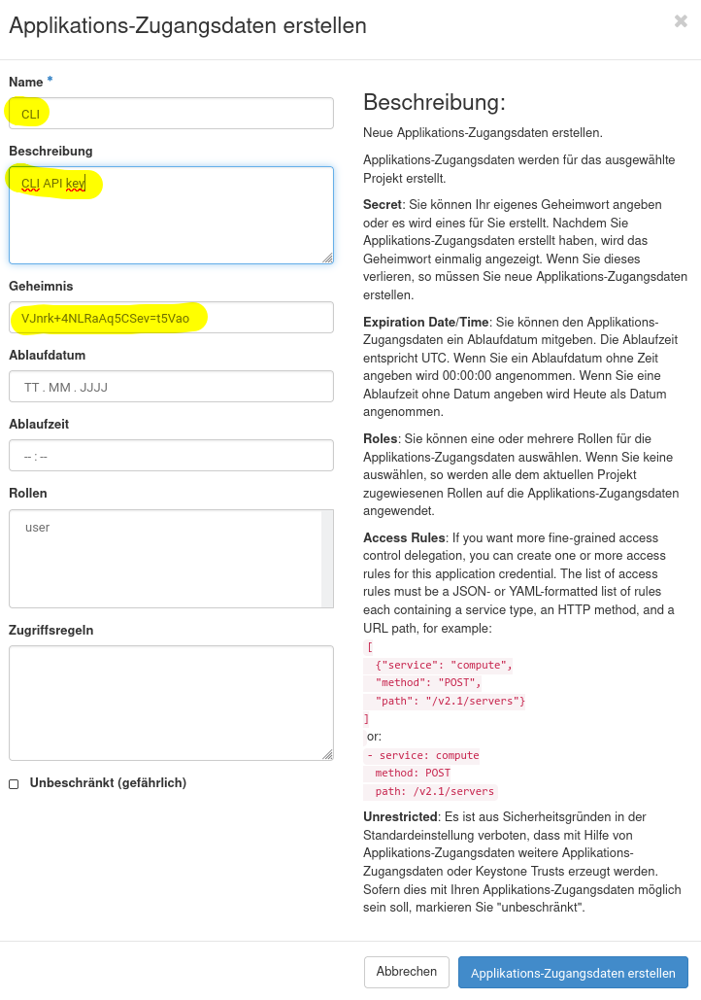

# How to migrate your old bwCloud Freiburg images to the new bwCloud

A service from bwForCluster NEMO.

!!! attention "DISCLAIMER"
    This in an unofficial migration guide.
    We do not guarantee for defective images or if the instructions do not work as described.

## Community Migration Guide

This guide is only for users of the University of Freiburg who have bwCloud images in the Freiburg region and want to migrate them to the new bwCloud.

Follow these steps:

1. First install [`python-openstackclient`](https://pypi.org/project/python-openstackclient/) CLI, e.g:
```bash
pip install python-openstackclient --user
```
Some distributions provide packages, you can check first.
Windows users could try to use [Windows Subsystem for Linux](https://docs.microsoft.com/en-us/windows/wsl/install) or Linux in VirtualBox, etc.
2. Create a credentials file for the old bwCloud instance, e.g.: `bwcloud-old-creds.sh`
Copy the contents of the following code window and replace `<RZ_ID>` with your University ID, e.g. you use for myLogin or [myAccount](https://myaccount.uni-freiburg.de).
Change your project name if necessary.
```bash
#!/usr/bin/env bash
export OS_AUTH_URL=https://idm01.bw-cloud.org:5000/v3
export OS_USERNAME="<RZ_ID>@uni-freiburg.de"
# change to old group project if necessary, e.g. freiburg_mygroup
export OS_PROJECT_NAME="Projekt_$OS_USERNAME"
unset OS_PROJECT_ID
export OS_USER_DOMAIN_NAME="Default"
if [ -z "$OS_USER_DOMAIN_NAME" ]; then unset OS_USER_DOMAIN_NAME; fi
export OS_PROJECT_DOMAIN_ID="default"
if [ -z "$OS_PROJECT_DOMAIN_ID" ]; then unset OS_PROJECT_DOMAIN_ID; fi
unset OS_TENANT_ID
unset OS_TENANT_NAME
echo "Please enter your OpenStack Password for project $OS_PROJECT_NAME as user $OS_USERNAME: "
read -sr OS_PASSWORD_INPUT
export OS_PASSWORD=$OS_PASSWORD_INPUT
export OS_REGION_NAME="Freiburg"
if [ -z "$OS_REGION_NAME" ]; then unset OS_REGION_NAME; fi
export OS_INTERFACE=public
export OS_IDENTITY_API_VERSION=3
```
3. Open a shell like `bash` or if you use a different shell start `bash`.
4. Source your old bwCloud credentials.
You will be prompted for your old bwCloud password.
If you don't remember it, bwCloud support will need to generate you one.
```bash
$ source bwcloud-old-creds.sh
Please enter your OpenStack Password for project Projekt_<RZ_ID>@uni-freiburg.de as user <RZ_ID>@uni-freiburg.de: 
```
5. Run `openstack server list`.
You should see your images or the images from your group project.
Copy the ID of the image you want to download, e.g. `7fd1037e-b9fa-464b-9704-0dd60461d83a`.
6. There should be a snapshot of this image you can download.
To check that, use this ID to get the ID of the snapshot:
```bash
$ openstack image list --shared | grep 7fd1037e-b9fa-464b-9704-0dd60461d83a
| 3e51e17a-c04d-345a-8712-a13f3b8fb99b | 7fd1037e-b9fa-464b-9704-0dd60461d83a-snapshot-2022-03-11-19-40-06 | active |
```
7. Use the snapshot ID for your download:
```bash
$ glance image-download 3e51e17a-c04d-345a-8712-a13f3b8fb99b --file myimage.img
```
8. Once your image is downloaded, visit [https://portal.bw-cloud.org/project/images](https://portal.bw-cloud.org/project/images) and select "Compute -> Images":

9. Configure and uplaod your image.
Minimum settings for disk and RAM are optional.
Select visibility **Private**!
!!! attention
    If you don't select visibility "Private" others can use your image as base image for their services.

10. You can start a new instance with this image.
Many other OpenStack settings have to be re-configured, like "security groups".

### Upload Image through CLI

If for some reason GUI upload does not work, you can try the CLI.

1. Login to bwCloud: [https://portal.bw-cloud.org/identity/application_credentials/](https://portal.bw-cloud.org/identity/application_credentials/).
Select "Identity -> Application Secrets".

2. Select a name and set a strong secret.

3. Download `openrc` file.
4. Open a new bash window and source the credentials:
```bash
source app-cred-CLI-openrc.sh
```
5. Create/Upload image to new bwCloud:
```bash
openstack image create --file myimage.img --private myimage
```